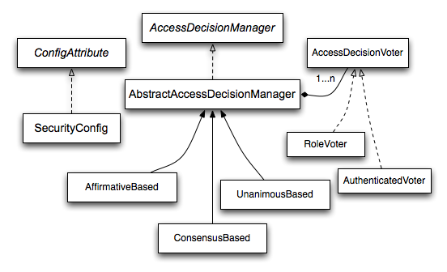
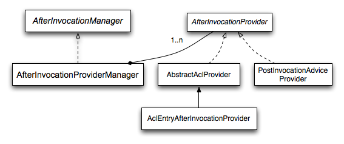
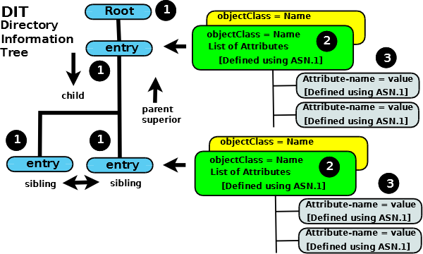
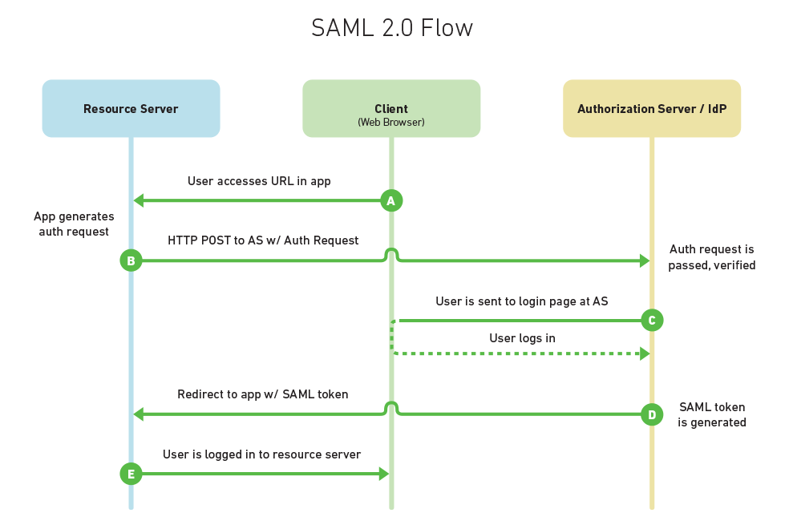
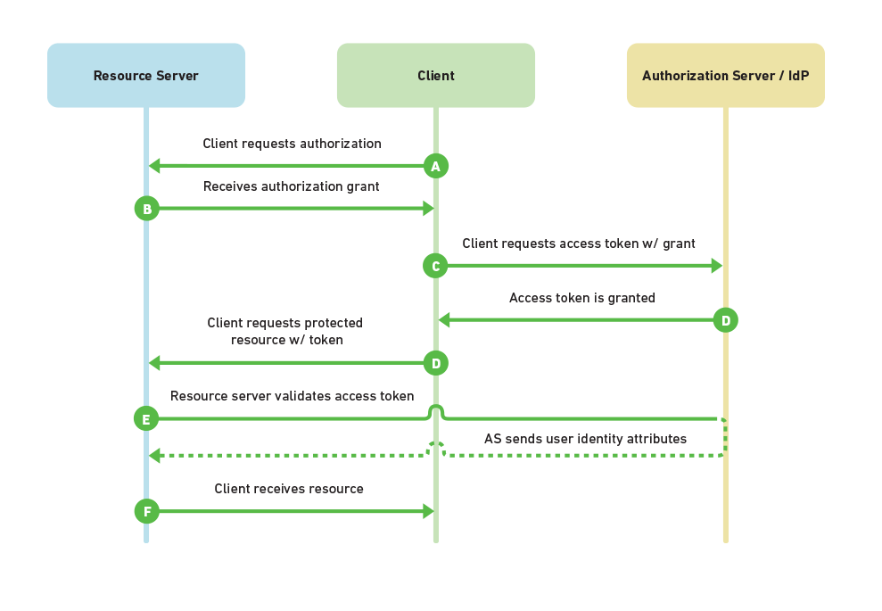

# spring-security-demo
代码部分为通过Spring boot + Spring Security + Thymeleaf实现认证和授权的demo

## RBAC
Role-Based Access Control 基于角色的访问控制。RBAC认为权限过程可以抽象概括为：判断［Who是否可以对What进行How的访问操作］这个逻辑表达式是否为true。

### 安全原则
 - 最小特权原则
 - 责任分离原则
 - 数据抽象原则
 
### 定义
在一个组织中，会因为不同的作业功能产生不同的角色，执行某项操作的权限会被赋予特定的角色。组织成员或者工作人员（抑或其他系统用户）则被赋予不同的角色，这些用户通过被赋予角色来取得执行某项计算机系统功能的权限。
 - S = 主体
 - R = 角色
 - P = 权限
 - SE = 会期 = S, R, P之间的映射关系
 - SA = 主体指派
 - PA = 权限指派
 - RH = 角色阶层。能被表示为：≥ (x≥y代表x继承y的权限)
 - 一个主体可对应多个角色
 - 一个角色可以对应多个主体
 - 一个角色可拥有多个权限
 - 一种权限可被分配给多个角色
 - 一个角色可以有专属于自己的权限
 
## Spring Security
### java.security.AuthenticatedPrincipal
接口，代表Authentication请求经AuthenticationManager成功认证后的认证主体。声明方法：
 - String getName()：返回认证主体的名称，不会为空。

### org.springframework.security.core.Authentication
接口，一个请求被AuthenticationManager.authenticate()处理后，Authentication可以代表一个认证过的请求／主体并通过认证机制存储于由
SecurityContextHolder管理的SecurityContext中。此外，Authentication可以不使用认证机制，由
SecurityContextHolder.getContext().setAuthentication(anAuthentication)设置。

### org.springframework.security.core.GrantedAuthority
接口，代表一个对象被授予的权限。

### org.springframework.security.core.context.SecurityContextHolderStrategy
接口，表明针对特定线程的安全上下文存储策略，有以下三种实现：
 - org.springframework.security.core.context.ThreadLocalSecurityContextHolderStrategy：接口的基本实现，变量contextHolder的类型为ThreadLocal<SecurityContext>
 - org.springframework.security.core.context.InheritableThreadLocalSecurityContextHolderStrategy：接口的基本实现，变量contextHolder的类型为InheritableThreadLocal<SecurityContext>
 - org.springframework.security.core.context.GlobalSecurityContextHolderStrategy：JVM中所有的实例共享一个安全上下文的策略，变量contextHolder的类型为SecurityContext
 
### org.springframework.security.core.context.SecurityContextHolder
存放安全上下文存储策略，安全上下文的get、set、create都通过操作strategy变量实现。

安全上下文存储策略通过设置java系统变量spring.security.strategy实现（可通过命令行参数或使用System.setProperty()设置），spring.security.strategy有以下三种值：
 - MODE_THREADLOCAL：默认的策略。对应ThreadLocalSecurityContextHolderStrategy。
 - MODE_INHERITABLETHREADLOCAL：对应InheritableThreadLocalSecurityContextHolderStrategy。
 - MODE_GLOBAL：对应InheritableThreadLocalSecurityContextHolderStrategy。
 
### org.springframework.security.core.context.SecurityContext
接口，定义与当前执行线程相关的最小安全信息。基本实现为SecurityContextImpl。

### org.springframework.security.core.userdetails.UserDetails
接口，提供帐号、密码、过期、锁定、认证过期等主要用户信息的方法。

### org.springframework.security.core.userdetails.UserDetailsService
接口，用于获取用户特定信息。主要作为DAO由org.springframework.security.authentication.dao.DaoAuthenticationProvider使用。声明了：
 - UserDetails loadUserByUsername(String username) throws UsernameNotFoundException

### org.springframework.security.access.intercept.AbstractSecurityInterceptor
抽象类，用于安全对象的访问控制，各Manager接口的decide方法都在这个类中被调用。用于访问控制的方法有：
 - InterceptorStatusToken beforeInvocation(Object object)：调用RunAsManager和AccessDecisionManager进行预处理。
 - void finallyInvocation(InterceptorStatusToken token)：用于重置SecurityContext（RunAsManager可能修改Authentication）。
 - Object afterInvocation(InterceptorStatusToken token, Object returnedObject)：使用AfterInvocationManager修改返回结果的内容。

三个方法在子类的invoke方法中被调用。

### org.springframework.security.access.ConfigAttribute
接口，存放安全系统（RunAsManager、AccessDecisionManager）相关的配置。 

### org.springframework.security.access.AccessDecisionManager
接口,用于访问控制,实现的抽象类为AbstractAccessDecisionManager。
 
### org.springframework.security.access.AbstractAccessDecisionManager
抽象类，实现了AccessDecisionManager中的方法如下：
 - void decide(Authentication authentication, Object object, Collection<ConfigAttribute> configAttributes)：由子类实现。拒绝访问时抛出InsufficientAuthenticationException。
 - boolean supports(ConfigAttribute attribute)：迭代调用AccessDecisionManager的AccessDecisionVoter判断参数ConfigAttribute是否能被AccessDecisionManager处理。任意AccessDecisionVoter支持时返回true。
 - boolean supports(Class<?> clazz)：迭代调用AccessDecisionManager的AccessDecisionVoter判断参数类型是否能被AccessDecisionManager处理。所有AccessDecisionVoter支持时返回true。
 
有3个子类：
 - AffirmativeBased：有投赞成票时允许访问。无赞成票和反对票时，若AbstractAccessDecisionManager.allowIfAllAbstainDecisions（默认为false）为true则允许访问。否则拒绝访问。
 - ConsensusBased：赞成票大于反对票或赞成、反对等票且AbstractAccessDecisionManager.allowIfAllAbstainDecisions（默认为false）为true时允许访问。否则拒绝访问。
 - UnanimousBased：无任何反对票，且赞成票大于0或AbstractAccessDecisionManager.allowIfAllAbstainDecisions（默认为false）为true时允许访问。否则拒绝访问。

### org.springframework.security.access.AccessDecisionVoter
接口，AbstractAccessDecisionManager中包含若干个AccessDecisionVoter，在supports和decide方法中会被调用。声明方法如下：
 - boolean supports(ConfigAttribute attribute)：影响AbstractAccessDecisionManager的supports方法的返回结果。
 - boolean supports(Class<?> clazz)：影响AbstractAccessDecisionManager的supports方法的返回结果。
 - int vote(Authentication authentication, S object, Collection<ConfigAttribute> attributes)：影响AbstractAccessDecisionManager的decide方法的返回结果。返回值有：ACCESS_GRANTED = 1，ACCESS_ABSTAIN = 0，ACCESS_DENIED = -1。

常用的实现类有：
 - AuthenticatedVoter：根据认证状态决定放回结果。
 - RoleVoter：根据认证拥有的角色决定返回结果。
 - RoleHierarchyVoter：RoleVoter的子类，根据认证拥有的角色及角色的继承关系决定返回结果。
 
### org.springframework.security.access.intercept.AfterInvocationManager
接口，用于修改执行内容的返回结果。实现类为AfterInvocationProviderManager，AfterInvocationProviderManager实现了：
 - Object decide(Authentication authentication, Object object, Collection<ConfigAttribute> attributes, Object returnedObject) throws AccessDeniedException：使用AfterInvocationProvider列表依次改变返回结果。
 - boolean supports(ConfigAttribute attribute)：任意AfterInvocationProvider支持改属性时返回true。
 - boolean supports(Class<?> clazz)：所有AfterInvocationProvider支持改属性时返回true。
 

 
### org.springframework.security.access.AfterInvocationProvider
接口，供AfterInvocationProviderManager调用，实现类为PostInvocationAdviceProvider，实现了：
 - Object decide(Authentication authentication, Object object, Collection<ConfigAttribute> attributes, Object returnedObject) throws AccessDeniedException：处理返回结果。
 - boolean supports(ConfigAttribute attribute)：参数类型是PostInvocationAttribute时返回true。
 - boolean supports(Class<?> clazz)：参数类型是MethodInvocation或是MethodInvocation的超类／接口时返回true。

### org.springframework.security.access.intercept.RunAsManager
接口，用于替换当前安全对象的Authentication对象。AbstractSecurityInterceptor会在当前安全对象的调用过程中替换SecurityContext中的Authentication，并在调用结束时将Authentication换回原来的值。有以下实现：
 - RunAsManagerImpl：RunAsManager的基本实现。
 - NullRunAsManager：在不需要RunAsManager的功能时使用。在AbstractSecurityInterceptor调用RunAsManager方法时不做任何事。
 
在RunAsManagerImpl中实现了以下RunAsManager的方法：
 - Authentication buildRunAs(Authentication authentication, Object object, Collection<ConfigAttribute> attributes)：若attributes中任意属性前缀为RUN_AS_，则将所有RUN_AS_开头的属性加上ROLE_前缀作为新的
 角色，和其他authentication的角色一起作为参数创建一个RunAsUserToken对象作为Authentication的返回值。
 - boolean supports(ConfigAttribute attribute)：属性前缀为RUN_AS_时返回true。
 - boolean supports(Class<?> clazz)：返回true。

### org.springframework.security.authentication.AuthenticationManager
接口，在安全对象被AbstractSecurityInterceptor处理前（beforeInvocation）被调用，如果未认证或alwaysReauthenticate为true则使用AuthenticationManager进行重新认证。AbstractSecurityInterceptor使用的默认实现为内部类NoOpAuthenticationManager，用于直接抛出AuthenticationServiceException。

### org.springframework.security.provisioning.UserDetailsManager
接口，UserDetailsService的子类，声明了：
 - void createUser(UserDetails user)
 - void updateUser(UserDetails user)
 - void deleteUser(String username)
 - void changePassword(String oldPassword, String newPassword)
 - boolean userExists(String username)

## LDAP
Lightweight Directory Access Protocol 轻量目录访问协议。在Spring Security可替代RDBMS用于认证。

### 定义
LDAP定义了：
 - 1、获取目录数据方法的协议。
 - 2、数据在目录服务中的展现方式。
 - 3、数据在目录服务中导入／导出的方式。
 
LDAP没有定义：
 - 1、数据的存储和操作方式。（数据的存储和获取往往由实现LDAP方法的特定事物数据库处理。）
 
### 数据结构
 - DIT(Directory Information Tree):在LDAP系统中数据以层级对象的形式展示。
 - attribute:每个attribute都有一个唯一的名字并包含存储的数据。attribute是一个或多个objectClass的成员。
 - objectClass:attribute的容器，定义了每个属性必须/可选存在。每个objectClass都有唯一的名字。
 - entry:DIT的节点。每个entry有任意数量的子节点以及一个父节点。每个entry是一个或多个objectClass的实例。
 - root:DIT的根节点。
 

### 对比RDBMS
在性能上，RDBMS系统要明显优于LDAP，但LDAP有以下优势：
 - 1、LDAP提供了获取远程／本地数据的标准化接口。因此在替换LDAP实现时可以完全不影响外部的接口。RDBMS大多只实现了标准化的本地接口，远程接口往往是专有的。
 - 2、由于LDAP使用标准化接口，LDAP的客户端和服务端的开发／来源可以做到彼此独立。此外LDAP可以用于抽象面向事务的数据库包含的数据视图（比如运行用户查询）的同时允许用户透明的更改事务数据库。
 - 3、LDAP可以在不影响外部数据获取的情况下将数据移动到多个存储位置。只需要更改操作字段，LDAP的转介方法就可以将数据移动到可选的LDAP服务器。因此LDAP可以在数据来源与不同匿名组织的情况下构建分布式系统，同时向用户提供唯一且一致的数据视图。
 - 4、LDAP可以通过更改配置将数据复制到一个或多个LDAP服务器／应用，不需要增加代码或改变外部获取数据的方式。

## SSO
 - Service Provider (Resource Server)：资源服务器，即用户访问的服务器。
 - Client：用户与资源服务器交互的客户端，如浏览器、app。
 - Identity Provider (Authorization Server)：存储用户身份和证书的授权服务器。
### SAML2
工作流如下：

### OAth2
工作流如下：

### 对比
SAML2优势：SAML的令牌包含用户信息，而Oath2的资源服务器需要向授权服务器发送额外的请求才能获得用户信息。

Oath2优势：Oath2的资源服务器可以验证并拒绝授权服务器的令牌，从而阻止对资源服务器的进一步访问。

## 参考文档
* [https://zh.wikipedia.org/zh-hans/以角色为基础的存取控制/](https://zh.wikipedia.org/zh-hans/%E4%BB%A5%E8%A7%92%E8%89%B2%E7%82%BA%E5%9F%BA%E7%A4%8E%E7%9A%84%E5%AD%98%E5%8F%96%E6%8E%A7%E5%88%B6)
* [https://docs.spring.io/spring-security/site/docs/current/reference/htmlsingle/](https://docs.spring.io/spring-security/site/docs/current/reference/htmlsingle/)
* [http://www.zytrax.com/books/ldap/](http://www.zytrax.com/books/ldap/)
* [https://www.mutuallyhuman.com/blog/choosing-an-sso-strategy-saml-vs-oauth2/](https://www.mutuallyhuman.com/blog/choosing-an-sso-strategy-saml-vs-oauth2/)

